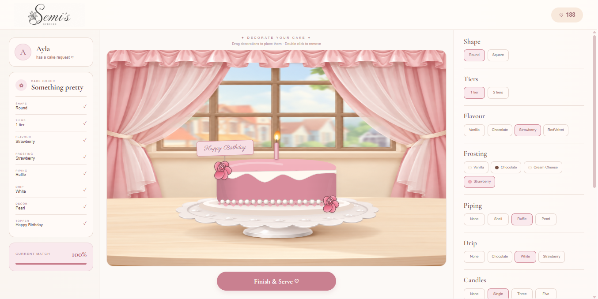

# 🍰 Semi's Kitchen

An interactive cake decorating game built with React, where you create cakes based on customer orders, decorate them, complete orders, and earn rewards.

🎮 Live Demo: https://semi-kitchen.vercel.app/

💻 GitHub: https://github.com/fidah-sathar/semi-kitchen

## 📸 Preview

## ✨ About the Project

Semi's Kitchen is a frontend game built around a virtual bakery experience.

Players receive cake orders from different customers and create their cakes by choosing flavours, frosting, piping, decorations, toppers, candles, and other details. Once the cake is complete, the player submits the order and receives a score and reward based on how closely the finished cake matches the customer's request.

The project was built to explore interactive frontend development, React state management, SVG-based rendering, drag-and-drop interactions, and game-style UI logic.

## 🎮 How to Play

1. 👩‍🍳 Receive a cake order from a customer
2. 🎂 Choose the cake shape, flavour, frosting, and other details
3. 🎀 Decorate the cake with different elements
4. 🖱️ Drag, rotate, resize, or remove decorations
5. ⭐ Complete the customer's order
6. 🪙 Receive a match score and reward
7. 👥 Move on to the next customer

## ✨ Features

- 👩‍🍳 Customer-based cake orders
- 🎂 Interactive cake customization
- 🍫 Multiple cake flavours
- 🎨 Custom frosting and cake colours
- 🎀 Multiple piping and decoration options
- 🕯️ Cake toppers and candles
- 🖱️ Drag, rotate, and resize decorations
- ❌ Delete individual decorations
- ↕️ Layer controls for decorations
- ⭐ Customer order matching and scoring
- 🪙 Reward and coin system
- 👥 Multiple customer orders
- 🎮 Game-style progression
- 🏠 Custom bakery environment
- 📱 Responsive frontend interface

## 🧠 Technical Highlights

### React State Management

The game uses React state to manage cake customization, customer orders, decorations, scoring, rewards, and progression between customers.

### SVG Cake Rendering

The cake is rendered using SVG to create and control cake layers, frosting, piping, drips, decorations, candles, and other visual elements dynamically.

### Interactive Decorations

Cake decorations can be interacted with directly using pointer-based interactions, allowing players to drag, rotate, resize, reposition, layer, and delete individual elements.

### Dynamic Order Matching

The game compares the finished cake with the customer's requested specifications and calculates a match score that determines the final reward.

### Conditional Game States

The interface changes based on the current stage of the game, including active orders, cake decorating, completed orders, rewards, and moving to the next customer.

## 🛠️ Tech Stack

- React.js
- JavaScript
- CSS
- SVG
- Vite

## 📁 Project Structure

src/
├── App.jsx
├── App.css
├── index.css
└── main.jsx

public/
├── cake-room.png
└── semi-logo.png

## 🚀 Getting Started

Clone the repository:

git clone https://github.com/fidah-sathar/semi-kitchen.git

Navigate to the project:

cd semi-kitchen

Install dependencies:

npm install

Start the development server:

npm run dev

Open the local URL shown in the terminal.

## 🌐 Live Demo

🎮 Play the game:

https://semi-kitchen.vercel.app/

## 🎯 Project Goals

This project was created to strengthen practical frontend development skills by combining:

- Interactive UI design
- React component-based development
- State management
- SVG rendering
- Pointer-based interactions
- Conditional rendering
- Game logic
- Responsive styling

## 👩‍💻 Author

Fida Sathar

GitHub: https://github.com/fidah-sathar